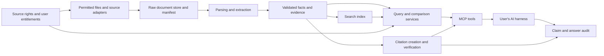

# Architecture and proposed MCP contracts

Design proposal, updated 24 September 2026. Some foundations are now implemented; [current tool contracts](../tools.md) and [implementation history](../implementation.md) are authoritative for delivered behavior. The citation component below remains proposed.

## Product shape

Margin is a reusable data and evidence backend with an MCP interface. The user's harness selects the model and writes the narrative. Plain Python callers should be able to invoke the same domain services; an optional REST adapter can serve non-MCP integrations later. Do not make the first release depend on a separate chat UI or on a particular model API.



Acquisition runs as an import command or worker, independently of tool requests. Slow OCR and batch parsing must not hold an interactive MCP request open. Return document status when processing is incomplete.

Citation creation and verification is a first-class domain component in the same Python application. It resolves archived evidence, checks document/location integrity and financial context, generates canonical citations, and checks claims against those citations. Structured numeric verification is deterministic; open-ended narrative support needs separate evaluation and may remain unverified. See [contracts, verdicts, test cases and implementation slices](citations.md). A citation proves traceable source support within its assessed scope, not the objective truth of a disclosure.

## Implementation options

| Decision | Recommended first choice | Alternative and when useful |
| --- | --- | --- |
| Backend | Python, already selected for parsing, validation and calculations | TypeScript if the team prefers a single web/backend language |
| MCP | Official Python SDK 2.2.0, currently pinned | Official TypeScript SDK; same domain/API separation |
| Data models | Typed validation models and decimal arithmetic | Equivalent runtime schema validation in TS |
| Local store | SQLite plus private filesystem objects | PostgreSQL when concurrent hosted use justifies it |
| Search | SQL filters and lexical full-text search | Embeddings after measuring passage-retrieval failures |
| PDF | pdfplumber is implemented for page inspection and explicit regions; validate real extraction | Layout/OCR pipeline for scans and difficult tables; inspect dependency licenses |
| XBRL | Standards-aware parser/validator and explicit taxonomy mappings | Controlled XML extraction only for narrow, validated cases |
| Scheduling | Explicit import CLI, then one scheduled worker | Queue when workload and retry requirements grow |
| Hosted objects | S3-compatible private storage | Filesystem on one durable host for a small deployment |
| Model use | Host-side synthesis | Optional extraction assistance with review and source pointers |

At the 23 September 2026 research check, Python and TypeScript were listed as Tier 1 official SDKs, and the documentation resolved to the 2026-07-28 specification. Standard transports in that reference include stdio and Streamable HTTP. Verify the pinned SDK and target-host compatibility rather than combining examples from different versions. [SDK directory](https://modelcontextprotocol.io/docs/sdk), [transport specification](https://modelcontextprotocol.io/specification/2026-07-28/basic/transports).

Start with one Python service. Splitting Python ingestion and a TypeScript MCP gateway immediately would add contracts and deployment work without a demonstrated need.

## Domain records

Separate **issuer**, **security**, and **listing**. A legal company may issue several securities and have multiple exchange listings. ISIN belongs to the security; symbol and exchange code belong to a listing; CIN belongs to the legal issuer. Keep aliases and validity intervals rather than using a ticker as an immutable primary key.

Proposed logical records: `Issuer`, `Security`, `Listing`, `Document`, `DocumentVersion`, `EvidenceLocation`, `ReportedFact`, `DerivedFact`, `SourcePolicy`, `IngestionRun`, `CoverageRecord`. These are target concepts, not a list of implemented Python classes.

A fact needs: issuer/security context where relevant, canonical metric, original label, decimal value, original value text, currency, scale, normalized value, period start/end, instant/duration, fiscal year/quarter, standalone/consolidated basis, accounting standard, audit/review status, segment and other dimensions, source/version/location, extraction method/version, and validation state.

Store zero distinctly from absent, unavailable or unparsed. Preserve ₹ crore, ₹ lakh, millions and per-share units before normalization. Do not round intermediate calculations to display precision. Retain source precision and avoid implying more accuracy than the filing provides.

## Proposed small tool surface

| Tool | Main arguments | Result / behavior |
| --- | --- | --- |
| `lookup_company` | `query`, optional `exchange`, `limit` | Candidate issuer/security/listing records; surface ambiguity |
| `get_coverage` | optional `company_id`, `document_type` | Available periods, ingestion times, gaps, source access scope |
| `list_filings` | `company_id`, `types`, date range, `as_of`, cursor | Metadata and stable IDs; filter announcements here initially |
| `get_filing` | `filing_id` | Metadata and permitted content/resource reference; respect document status |
| `search_evidence` | `query`, company/filing filters, `limit` | Bounded passages with page/section citations |
| `get_financial_facts` | `company_id`, metric list, periods, basis, `as_of` | Typed reported facts and evidence; require an explicit/default-disclosed basis |
| `compare_periods` | company, metrics, two periods, basis, optional `as_of` | Compatible inputs, deterministic deltas, formula and exclusions |

Current tools stop at filing metadata. Stage the remaining work: reviewed facts/evidence and citations → comparison → passage search. Schema design should follow realistic questions, not a desire to expose many tools.

Each response includes a schema version, data, evidence references, coverage, warnings, and pagination where applicable. Bound text and result counts so a broad query cannot fill the model context. `get_filing` should not send base64 copies of long PDFs by default. Resource links and prompts are optional conveniences; the core workflow must remain usable by hosts that primarily consume tools.

Use a prompt template for company briefs after data tools work. It should ask the host to separate disclosed facts from interpretation and cite every material claim. A `build_company_brief` tool is unnecessary if it only reproduces the host's writing capability.

## Comparison rules

Require the same issuer, metric definition, scope, accounting basis, currency and compatible dimensions. Convert scale deterministically. Do not mix a quarter with year-to-date or a duration measure with a balance-sheet instant. Make same-quarter YoY and adjacent-quarter QoQ explicit choices.

Define percentage growth only for a meaningful nonzero baseline. Return an absolute delta and a warning for zero or negative bases rather than an unqualified percentage. Ratios changing from 10% to 12% rise by 2 percentage points; make that distinct from 20% relative growth.

Q4 derived as annual minus nine months is a derived fact with both sources, matching definitions, and a comparability check. EPS is not generally additive. Separate profit for the period from profit attributable to owners. Balance-sheet cash is not automatically cash plus investments. EBITDA and operating margin need explicit formulas or reported definitions.

Start with non-financial companies; banks, insurers and NBFCs need dedicated metric dictionaries and comparability rules. Assess acquisitions, discontinued operations, fiscal-year changes and restatements rather than assuming a matching label guarantees comparability.

## Extraction and reliability

Prefer structured source facts when available, retaining XBRL taxonomy version, concept, context, unit, decimals and dimensions. Structured data can still contain filing errors. For PDFs, identify page, table, row, column and, where possible, bounding box. A text match without its column heading is insufficient evidence for a number.

Use accounting identities and cross-document agreement as checks, not as permission to invent missing cells. OCR/LLM candidates must retain their evidence and validation state. Model confidence is not a substitute for verification.

Implement timeouts, bounded retries with backoff, cache keys scoped to source/version/rights, content-type and size validation, and observable failures. Treat document text as untrusted data. Arbitrary URL ingestion needs network allowlists and redirect checks; XML parsing must disable external entities; uploaded files need path and size boundaries.

## Local and hosted deployment

The free prototype runs on a team machine with SQLite and local files. A local MCP process must reserve stdout for protocol messages and send logs elsewhere. Verify actual tool discovery, calls, errors and citations in one chosen host, then a second host before claiming portability.

Later, run ingestion separately from a Streamable HTTP service, using PostgreSQL and private object storage. Add tenant isolation, source entitlements, quotas, audit events and backups. Hosted MCP authorization should follow the applicable protocol and host requirements; do not assume one ad hoc API-key configuration works everywhere. [Authorization specification](https://modelcontextprotocol.io/specification/2026-07-28/basic/authorization).

A container on a small server, managed container hosting, and serverless hosting are all possible. A conventional worker/service deployment is the initial preference because PDF parsing may be slow and storage must persist. No hosting purchase or platform commitment is needed now.

Suggested eventual layout:

```text
src/margin_mcp/
  adapters/       # permitted source and file acquisition
  ingestion/      # manifests, versions, jobs
  parsing/        # PDF, HTML, XBRL
  domain/         # entities, metrics, comparison rules
  storage/        # repositories and source entitlements
  services/       # host-independent queries
  server/         # thin MCP handlers
tests/fixtures/   # synthetic or redistribution-cleared examples
evaluation/      # questions, labels, scoring, experiment manifests
```
