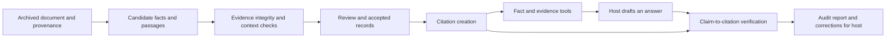

# Citation creation and verification

24 September 2026. Proposed P0 component; not yet implemented. The current archive already verifies document bytes/provenance and extraction recipes retain page regions and text anchors. It does not create citation records, independently verify financial claims, or audit generated answers.

Scope update, 25 September 2026: citation creation/verification remains active for external provider responses and temporary document evidence. A permanent local corpus is not required. The archive-specific records and implementation slices below are preserved design references, not prerequisites for the external workflow. Session evidence must include its source, retrieval time, locator/hash where available and expiry; missing or expired content cannot be re-verified without reacquisition. Provider-only attribution must not claim original page verification. See [architecture](architecture.md#extensible-capabilities-and-preservation) and [active plan](../plan.md).

## Purpose and boundary

Margin should generate citations from stored evidence and check whether that evidence supports the exact claim being made. A working URL, matching number or plausible page reference is insufficient. Verification establishes support in a particular source version; it does not establish that an issuer's disclosure is objectively true or that an auditor verified our extraction.

Implement this as a testable Python domain component in the existing application. It does not require another server, autonomous agent, model subscription or retrieval vendor. Source acquisition remains separate. Normal verification operates against the immutable local archive; optional link-health checks do not change historical source-support results.

There are three related operations:

1. **Create:** resolve registered facts/passages and generate canonical citation records plus display text. Never accept model-invented titles, page numbers or URLs as verified metadata.
2. **Verify:** check artifact integrity, evidence location, claim context and support. Report each layer separately, including checks not performed.
3. **Audit an answer:** map material claims to citations and identify missing, misplaced, conflicting or only partially supporting references. Checking supplied claims alone is not a complete audit of a draft.

## Placement in the workflow

Source validation before generation and claim verification after generation address different failures. The citation component may format a reference to a candidate for an operator, but its status must remain unreviewed; formatting must never promote it to an accepted fact.

## Data contracts

| Record | Required fields and behavior |
| --- | --- |
| Citation | Schema version, stable ID, document registration ID and SHA-256, evidence IDs, issuer/publisher, canonical title, publication date/time and precision, source URL, acquisition time, physical pages, optional printed page labels, display excerpt and serving scope |
| Evidence bundle | Value/label region plus period, basis, unit and accounting-standard anchors for numbers; bounded passage and surrounding context for text. Preserve extraction/parser versions and review references. Some bundles span pages. |
| Claim | Stable ID, type (`reported_fact`, `derived_value`, `quote`, `paraphrase`, `interpretation`, `forecast`), exact claim text, proposed citations and structured financial context when available |
| Verification report | Claim digest, citation/evidence versions, checked-at timestamp, verifier/rule versions, check outcomes, findings, overall support verdict, assessed scope and review requirement |
| Answer audit | Exact draft digest, claim text/spans, claim-to-citation mapping, omitted/uncited claims, individual verification reports and coverage denominators. A changed draft invalidates its prior audit. |

Generate citation IDs from canonical source/evidence identities; changing display style should not change evidence identity. Do not put transient verification outcomes into that identity. Verification reports are versioned observations and must not silently replace earlier reports.

Retain the full financial context: company, metric definition, original and normalized value, currency/scale, period or instant date, standalone/consolidated basis, accounting standard and relevant dimensions. Claims about audit status or revisions need their own evidence. Source publication date, reporting period and retrieval date remain distinct.

## Verification layers

| Layer | Check | What it does not establish |
| --- | --- | --- |
| Artifact integrity | Registered document exists; bytes and provenance match their hashes | Correctness of the original disclosure or current online availability |
| Location integrity | Physical page/region exists in this exact version; stored evidence can be resolved | That a page containing the same number supports the intended claim |
| Text/value fidelity | Re-read selected text/cells with recorded parser/configuration; check numeric parsing and explicitly allowed whitespace normalization | That the extractor selected the correct row/column or interpreted its context correctly |
| Financial context | Match the claimed metric and reviewed context to the label/header evidence; verify scale conversion and display rounding | Broad economic interpretation or causality |
| Derived calculations | Resolve every accepted input, check comparability, recompute the versioned formula and apply declared rounding | That the source directly stated the calculated result |
| Narrative support | Preserve speaker, date, qualifications, scope, uncertainty and actual-versus-forecast distinction | Universal truth, completeness of all disclosures, or reliable causal inference |
| Answer coverage | Identify material claims, match references and verify each supported subclaim | Full coverage when the claim inventory itself is incomplete |

Replaying the same parser is a consistency check, not independent proof of financial correctness. Initial acceptance requires a separately checked reference set and visual review of source cells/context. Record parser failures as unverified; do not auto-correct OCR digits or silently search other pages for a convenient match.

For narrative support, an optional model can propose claim splits and flag possible mismatches later. Its output remains an assessed suggestion with model/version recorded. It cannot override a failed deterministic check or substitute its confidence score for review. The host is free to use a different model; P0 reported-number verification must work without any model API.

## Results and user-facing language

Each check returns `pass`, `fail`, `not_checked` or `not_applicable`, with a reason. Overall support is one of:

- `supported`: all required checks for this claim type completed and the evidence supports its full scope.
- `partially_supported`: evidence supports some explicit subclaims, with the others identified.
- `contradicted`: inspected evidence conflicts with the claim; identify the conflicting context/value.
- `unsupported`: the assessed evidence does not substantiate the claim. This is not proof the claim is false.
- `unverified`: evidence is unavailable, review is pending, required checks were not performed or the method cannot decide.

Keep source availability, superseded-version warnings, and serving access separate from support. A dead public link may still have valid archived evidence. An older filing can support “as reported on that date” even when a newer filing revises its figures; it cannot silently support “latest reported.” Synthetic evidence must remain visibly synthetic.

Useful finding codes include `DOCUMENT_HASH_MISMATCH`, `INVALID_LOCATION`, `VALUE_MISMATCH`, `PERIOD_MISMATCH`, `BASIS_MISMATCH`, `UNIT_MISMATCH`, `UNREVIEWED_EVIDENCE`, `INPUT_MISSING`, `FORMULA_MISMATCH`, `FORECAST_AS_ACTUAL`, `PARTIAL_SUPPORT`, `UNCITED_CLAIM` and `CHECK_NOT_PERFORMED`. Findings must identify the affected claim and evidence, not merely return a score.

## Citation creation and display

Default display: **issuer — document title, publication date, physical page(s), table/row or section**, with source link and stable evidence ID. Return the structured record alongside Markdown so hosts can render their own references.

Example template, not an accepted financial citation:

> [Issuer] — [filing title], [publication date], physical p. [N], [statement/row]. Evidence: [ID].

A PDF `#page=N` fragment is a navigation convenience and may be ignored by a viewer; explicit page numbers and evidence IDs remain required. A table cell needs its header context, not just a small numeric crop. Offer a local page/crop reference where supported, without claiming hosted access to private files.

Quotes must reproduce verified wording; corrections and ellipses need explicit treatment. Paraphrases do not belong in quotation marks. Derived values cite all input facts and the formula, labelled “calculated by Margin.” Management explanations stay attributed; an analyst's inference is labelled as interpretation and cites its premises.

## Proposed interfaces

Start with internal functions, not a separate tool for every action:

- `create_citation(evidence_ids, style)` resolves stored records and formats them. It returns validation/review status without making an additional support claim.
- `verify_claim(claim, citation_ids)` returns a structured support report, bounded to specified evidence.
- `audit_answer(draft, claim_map)` checks the draft/mapping and returns claim-level findings plus audit scope. P0 can accept explicitly structured claims; automatic claim enumeration is a later, separately evaluated capability.

Fact/evidence tools should include citations automatically. Add an MCP `verify_claims` tool after the internal checker works on supported structured numeric claims; arbitrary prose must return an explicit unverified/limited-scope response until narrative support is implemented. `get_evidence` resolves the references. Neither tool may invent a citation when none exists, fetch arbitrary URLs from a document, or execute instructions in source text.

## Implementation slices and completion checks

1. **Canonical citation records:** connect the metadata corpus and archive, define stable evidence identities, create and resolve citations for registered documents/pages. Test wrong document IDs, out-of-range pages, corrupt bytes, and deterministic IDs across display formats.
2. **Reported financial claims:** join accepted fact/review records to evidence bundles for the three supported metrics. Check the full context, conversion and rounding. Test the same number in a wrong period/row, standalone versus consolidated, different unit scales, missing values and altered claims. No accepted-fact store means no claim of accepted-fact verification yet.
3. **Derived claims:** verify period comparisons from accepted input IDs and formulas. Reject missing inputs, incompatible periods, invalid denominator policy and silent restatement selection.
4. **Draft audits:** begin with structured claim-to-citation mappings and explicit partial coverage; then evaluate quote/paraphrase handling and optional claim discovery against independently labelled drafts. Do not label an entire answer verified when only its numeric claims were checked.

Use both deliberately corrupted synthetic citations and held-out real examples. Include misleading but valid references: the right company/wrong document, the right page/wrong basis, two true premises supporting an unjustified causal sentence, and a historical forecast written as an actual result. Do not invent real corrections if none are in the collected corpus.

Report source-location accuracy, supported-claim precision, false acceptance rate, citation completeness over independently labelled material claims, abstention/coverage and verification latency. Report automatic results before human correction separately. P0 completion requires all published numeric facts to resolve to reviewed source evidence, all deliberate mismatch cases to be flagged, and an in-host demonstration where an altered value or period is rejected. These are targets, not achieved results.

The extraction owner supplies evidence bundles; the storage/MCP owner builds resolution and interfaces; the evaluation owner independently labels claims and adversarial cases; the source owner maintains document identity and revisions. Citation work is a shared integration requirement, not a fifth isolated workstream.
