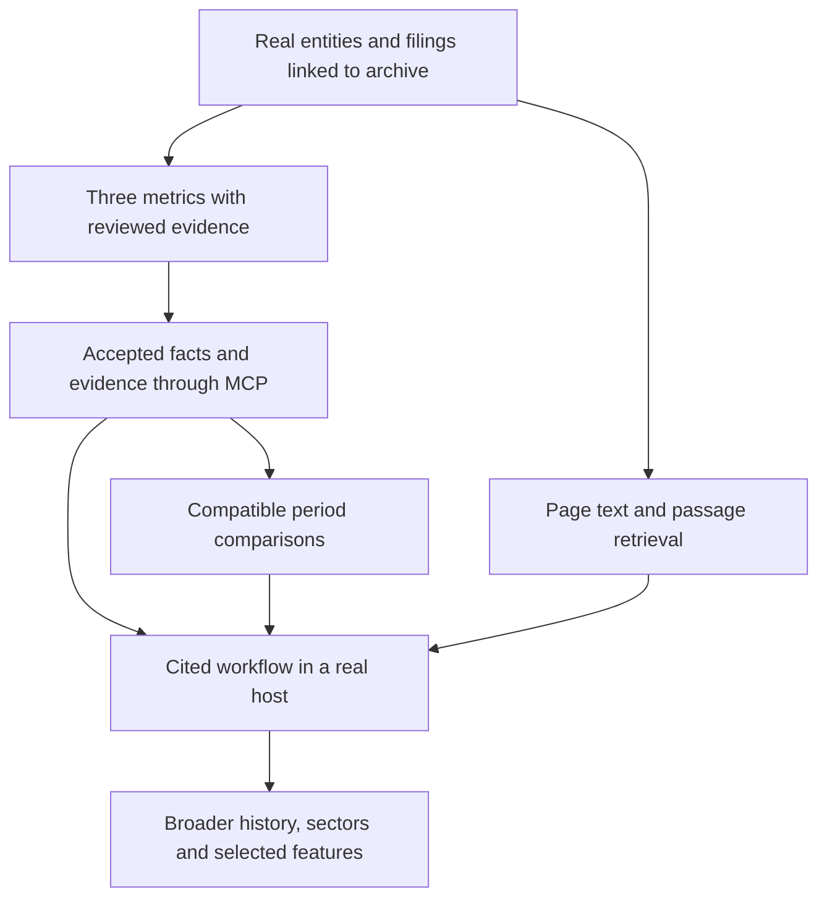

# Margin: functionality, data and delivery map

24 September 2026. This is a proposed implementation map grounded in the current repository and acquired corpus. It does not add tools or expand the current API contract.

## Product outcome and scope

A user should be able to resolve an Indian company, find a disclosure, obtain a financial fact, inspect its evidence, compare compatible periods and assemble a cited research brief in their own AI harness.

The next release should complete that workflow for a small declared corpus. Start with existing Wipro, TCS, Infosys and HCLTech documents; all four are IT businesses and the acquired documents concern September 2025. This is a historical development corpus, not current market coverage. Broader sector/history targets follow the core workflow and may require changing the final company selection.

Priority definitions: **P0** completes the first usable research workflow; **P1** adds research depth after P0 passes; **P2** is optional expansion. Source discovery can be manual during P0, provided coverage and provenance are explicit.

## Current baseline

- Four implemented MCP tools: `lookup_company`, `get_coverage`, `list_filings`, `get_filing`. They query imported metadata; bundled examples are synthetic. `get_filing` does not serve document content.
- Five real documents privately archived across four companies; reproducible acquisition from a curated URL/hash catalog. No automatic exchange discovery or refresh.
- CLI inspection and candidate extraction with hash-bound regions, context anchors and exact decimal parsing. Three supported metrics: revenue from operations, profit before tax, profit for the period.
- Archive company/filing references are not yet validated against the metadata corpus. There is no accepted-fact publication or review workflow, and no real financial facts served over MCP.
- [Current validation](../implementation.md#validation) records software checks. These are not a measured real-document extraction accuracy score; graphical host validation remains pending.

## P0: first usable workflow

| Functionality / example | Required data | What we have | Remaining implementation and completion check |
| --- | --- | --- | --- |
| Resolve a company: “Find TCS” | Canonical company ID, names/aliases; linked security/listing records with exchange codes, ISIN/CIN where verified | Lookup logic and synthetic entity fixtures; real issuer names and some identifiers in PDFs | Curate the four real entities and join archive references to them. Never invent missing identifiers. Verify exact/ambiguous matches and issuer versus security distinctions. |
| Find filings and inspect coverage | Filing ID, company ID, document purpose, period, publication precision, publisher, URL, source version; explicit collection gaps | Metadata tools and five archived documents in a separate store | Register real filing metadata and link it to archived document IDs. Return “latest in corpus”; show missing coverage and acquisition/parse/review states separately. |
| Retrieve evidence: “Show where that came from” | Immutable PDF/hash, physical page, text/cell coordinates, source URL, extracted passage and parser version | Raw archive, page inspection, extraction-region coordinates | Add a bounded evidence retrieval service and proposed `get_evidence` tool. Every reference must resolve to the exact archived version/page; expose excerpt availability independently from full PDF delivery. |
| Create and verify citations | Canonical source/evidence IDs, context anchors, accepted review records, exact claim, claim-to-citation mapping and verifier version | Hash/provenance checks and extraction anchors exist; no dedicated citation component | Build [citation creation and verification](citations.md). Generate references from stored evidence, check full numeric context and formulas, and report unsupported/unverified claims separately. Citation formatting does not imply claim support. |
| Get financial facts | Original label/value; canonical metric, currency/scale, reporting basis, accounting standard, period, audit status and evidence | Three-metric candidate extractor; results tables in real PDFs | Validate real recipes, add persisted review decisions and an accepted-fact view, then proposed `get_financial_facts`. Rejected/uncertain candidates must never appear as accepted facts. |
| Compare reporting periods | Two accepted facts with matching metric definition, basis, standard, currency, duration and relevant dimensions; revision policy | Comparative columns exist; no comparison service | Add deterministic calculations and proposed `compare_periods`. Return inputs, evidence, formula and result. Reject incompatible contexts; handle missing/zero denominators and negative-base growth explicitly. |
| Search/retrieve a relevant passage | Page text, stable passage IDs, section labels, company/filing filters and page provenance | Text can be inspected; no persistent passage search | Start with bounded page-aware lexical search and section retrieval. Test relevance and citation location; distinguish no match from unindexed content. Embeddings require evidence of a retrieval problem first. |
| Produce a cited brief in a user's host | Accepted facts, comparison outputs, relevant passages, dates and coverage warnings | Inputs partially available; host workflow not tested | Provide a prompt/example using the tools; the host writes the prose. Verify important claims against citations, separate management statements from interpretation, and demonstrate in one real MCP host. A dedicated brief tool is optional. |

These capabilities need not each become a separate MCP tool. Keep acquisition/review in operator workflows and expose a small read-only query surface. Proposed tool names are not implemented contracts.

## P1/P2: expansion and its data dependencies

| Priority / functionality | Additional data needed | Work beyond obtaining files |
| --- | --- | --- |
| P1: fuller statements and ratios | EPS, profit attributable to owners, balance sheets, cash flows and relevant notes | Add per-share/count/percentage units and instant-date facts. Define debt, margins and ratio formulas; some ratios need average balances or a complete trailing period. Preserve source-reported measures separately from derived measures. |
| P1: segments and operating metrics | Segment tables, presentations and fact sheets with dimensions and definitions | Define business/geography dimensions and handle segment changes. Headcount, utilization, attrition and deal bookings are company/sector-specific, not interchangeable generic fields. |
| P1: business, risk and management research | Annual reports, notes, management discussion, presentations and earnings-call transcripts | Section extraction, speaker/date attribution, risk taxonomy and evidence retrieval. A missing risk passage is not proof of no risk. Guidance is a dated forecast, not a realized result. |
| P1: announcements and events | Announcement history, event type, publication time, event/effective date, attachments | Event classification, duplicate/revision handling and bounded discovery. Board notices, outcomes and press releases about one event remain distinct records. |
| P1: dependable updates | An evaluated listing/feed source, durable cursors, checks of known documents and backfill metadata | Scheduled ingestion, conservative retries, reconciliation, source health and gap reporting. A successful PDF URL is not a discovery or completeness guarantee. |
| P2: ownership analysis | Shareholding-pattern disclosures, ownership categories, reporting dates and pledge disclosures | Category mappings, changes over time and explicit treatment of missing filings. Financial-statement share capital is not an ownership breakdown. |
| P2: valuation and market context | Dated prices, historical/adjusted series where needed, appropriate share counts, corporate actions and accepted financial inputs | Align timestamps and numerator/denominator definitions; calculate market cap/multiples reproducibly. Requires separate market-data access. |
| P2: macro context and analyst expectations | Economic series with release/revision dates; separately sourced consensus estimates | Additional adapters and freshness/definition checks. Neither is required for a cited historical-results workflow. |
| P2: hosted service | Serving permissions, user/access records and deployment configuration | Authentication, per-user access where applicable, quotas, backups, migrations, monitoring and host interoperability. Local-only document processing does not establish public redistribution rights. |

## Shared data contracts

These are logical records, not a requirement to create separate tables immediately:

1. **Entity/security/listing:** stable IDs and verified identifiers; allow missing values. Retain issuer/security separation already present in metadata models.
2. **Filing/document/source observation:** distinguish the disclosure from its files and download locations. Keep source publication date/time precision, retrieval time, bytes/hash, purpose, period, versions and publisher. Identical bytes can have multiple source observations; related attachments are not automatically substitutes.
3. **Evidence:** document hash/version, physical page, region or passage ID, original text and extraction version. Printed page labels may supplement physical page numbers.
4. **Fact/context:** original and normalized values, metric definition version, currency/scale, unit kind, period start/end or instant date, basis, standard, audit status and dimensions. These include proposed extensions beyond today's three-metric INR duration schema.
5. **Review/publication:** candidate ID, reviewer, decision, time, reasons and accepted version. Corrections preserve earlier runs; new failed extraction must not remove an accepted version.
6. **Derived result:** formula/version, exact input fact IDs, output unit and calculation rules. Never store calculated growth as if quoted from the filing.
7. **Coverage/operations:** expected versus observed documents where expectations are known, last source check, missing periods, failure reason, extraction/review state and serving scope. Acquisition time alone does not prove source freshness.

For real fact publication, first validate that archive company/filing IDs map to the real metadata corpus and that all evidence belongs to the claimed document. This join and the review gate are the current critical dependencies.

Citation records, evidence bundles, typed claims and versioned verification/audit reports extend these contracts; see [the citation design](citations.md). Verify source support before publication and check the host's resulting claims after generation. Do not treat URL validity or parser replay as independent claim verification.

## What else requires attention

| Focus | Concrete requirement | Evidence that it works |
| --- | --- | --- |
| Financial semantics | Separate quarter/YTD, instant/duration, standalone/consolidated, Ind AS/IFRS, crore/million, and total profit/owners' profit | Reviewed fact tuples and tests for incompatible comparisons, units and missing values |
| Revisions and time | Preserve original publication and later restatements; disclose the selected version and policy | Conflicting observations remain visible; later comparative figures are not presented as known at the original period-end |
| Parser reliability | Detect text-layer/layout errors; review unclear cells instead of guessing | Accuracy and abstention measured on held-out real pages, separately from corrected output |
| Evaluation | Independent labels for facts, evidence and answerability; distinguish synthetic tests from real benchmark | Begin with about 36 reviewed cells and a small workflow set; expand toward the existing 60-question benchmark with a held-out split |
| Host usability | Small typed responses, filters, pagination, actionable errors and installation documentation | A clean install and a cited multi-tool workflow in one graphical host; measure latency and task completion |
| Trust boundaries | Treat filing passages as untrusted content; do not let document instructions trigger tool execution; keep local ingestion out of read-only MCP queries | Evidence remains data; malformed inputs and failure responses are handled in tests |
| Data operations | Repeatable import, consistent IDs, immutable evidence, restore checks and visible source failures | Re-import/reprocess is safe; archived data can be restored and linked to accepted facts |
| Product usefulness | Focus on actual research tasks rather than tool count | Three to five users complete a fact verification/comparison task and report time, friction and citation usefulness |

## Build order and scope gates

1. **Connect the existing corpus.** Curate four real companies, classify five documents and link metadata to the archive. Exit: lookup → filing → available document/evidence references works without synthetic/real confusion.
2. **Validate the first facts.** Start with revenue, PBT and profit for the period on supported consolidated Ind AS tables. Manually verify labels, contexts and cells, with an independent reviewer. Exit: accepted facts and evidence resolve correctly through MCP; uncertain cells stay unpublished.
3. **Establish comparisons.** Use compatible comparative columns for an initial demonstration; acquire a second independent results filing per company to test different layouts and version handling. Two columns from one filing are not two independent source documents. Exit: reproducible comparisons and explicit rejection cases.
4. **Complete the research workflow.** Add passage retrieval and a host prompt/demo, then evaluate against manual labels. Exit: users can verify a number, compare periods and inspect supporting commentary.
5. **Expand selectively.** Add roughly six to ten well-defined metrics and annual-report passages before ownership/prices/macro. Longer-term coverage remains five selected non-financial companies, eight quarters and two annual reports each, subject to feasibility. Revisit the company selection for sector diversity rather than treating today's four IT issuers as the final universe.

The four-person team can own acquisition/entity records, extraction/financial definitions, storage/MCP/host integration, and evaluation/docs respectively. Agree on the shared contracts first and integrate against the same small corpus twice weekly. Independent numeric review crosses those ownership boundaries. These are proposed human workstreams, not assignments or parallel agents already launched.

## References and status boundaries

- [Implemented tools](../tools.md), [ingestion workflow](../ingestion-development.md), [implementation history](../implementation.md).
- [Working source catalog and acquisition results](../research/bse-acquisition-results.md).
- [Delivery and evaluation plan](../plan.md) for the broader schedule and benchmark.

No model training dataset, live feed, vector database, hosted deployment or custom chat frontend is required for the first release. Prioritize traceable facts and successful research tasks; add those dependencies only for a demonstrated need.
