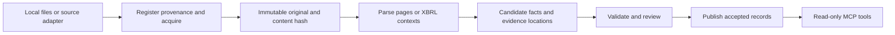

# Ingestion design: implemented foundations and remaining work

Design updated 25 September 2026; source/provider observations below originate from research on 23 September. PDF registration, region-based candidate extraction and curated acquisition are implemented; accepted-fact publication, automated discovery and other adapters remain proposed. Use [the ingestion guide](../ingestion-development.md), [acquisition guide](../acquisition-development.md) and [implementation status](../implementation.md) for current behavior.

## Recommendation

Scope clarification: this archive/import design remains supported alongside the proposed external API/tool and temporary-session paths. Persistent ingestion is optional for those future paths; existing local commands and MCP metadata contracts are preserved. Temporary parsing must not silently register documents in the archive. See [architecture](architecture.md#extensible-capabilities-and-preservation) for shared evidence, expiry and capability-routing requirements. No new external/session behavior is implemented by this design update.

Prioritize external-source adapters and temporary evidence retrieval. Preserve the existing private archive and curated downloader, but do not expand the corpus or require archive completion before provider integration. Treat acquisition and parsing as separate problems: a local PDF, an issuer download and an authorized exchange attachment can share the same parser.

The acquired documents and 36 selected real candidates remain development evidence; independent review is still pending. The earlier second-filing and broader collection targets are superseded by the [external-source delivery plan](../plan.md). Prefer digitally generated PDFs. Start with revenue from operations, profit before tax and profit for the period, preserving the exact original labels. Add profit attributable to owners and EPS separately; never map them blindly into a generic net-profit field. Banks and insurers need separate metric definitions and are outside this experiment.

## Sources and roles

| Source | Data/formats | Suggested use | Access state |
| --- | --- | --- | --- |
| Issuer investor relations | Results PDFs, annual reports, presentations, transcripts, HTML | Primary evidence for the first small corpus | Wipro results acquired twice; tested Infosys/TCS issuer requests were denied and HCLTech delivery failed |
| NSE/BSE filings | Financial results, announcements, ownership and governance disclosures; documents and structured filings | Cross-check completeness and timestamps; eventual acquisition adapter | Six BSE attachments acquired repeatedly and imported; tested NSE delivery failed; automatic discovery and hosted rights remain unresolved |
| Screener company pages | Observed annual-report and concall document links | Secondary discovery leading to original exchange/issuer attachments | Infosys page parsed; two BSE documents acquired through observed links; no whole-market completeness claim |
| Tijori company pages and file host | Annual-report, earnings-release, presentation and call-document links; platform financial/research views | Secondary discovery and validated alternate document locations | Infosys page parsed; two mirrors hash-matched BSE originals; broader document downloads and structured-data integration untested; see [access inventory](../research/corpus-trial.md#tijori-access-inventory) |
| NSE RSS | New corporate updates, including results and annual reports | Incremental discovery after a feed test | Categories documented; feed contents, retention, gap recovery and attachment delivery untested |
| Exchange XBRL | Tagged facts with periods, units and contexts | Prefer structured extraction when actual instance files are available | Filing/taxonomy documentation verified; no sample instance ingested or bulk endpoint established |
| Upstox fundamentals | JSON financial statements, ownership, ratios, corporate actions | Candidate structured adapter and cross-check | Authenticated API documented; account entitlement, history and product rights untested |
| Global Datafeeds | Results, announcements/attachments, annual reports, corporate data | Later commercial adapter | Catalog verified; historical backfill and license need clarification |
| User/institution-supplied files | PDF, XBRL, CSV/JSON exports | Useful private prototype and eventual customer-owned-data mode | Per-file provenance and usage scope required |
| MCA/OGD | Company-master identity data | Later CIN/entity enrichment | Catalog timed out in this pass; no current resource downloaded |
| MoSPI/RBI | Economic series, rates and macro context | Separate later adapter | MoSPI client documented; RBI portal yielded no inspectable API data in this pass |

[SEBI's directory](https://www.sebi.gov.in/curation/corporate_filings.html) maps filing categories to both exchanges. [NSE RSS](https://www.nseindia.com/static/rss-feed) lists discovery categories. [NSE XBRL documentation](https://www.nseindia.com/static/companies-listing/xbrl-information) explains taxonomy/instance contexts; it does not establish an external bulk archive.

The [Upstox income-statement contract](https://upstox.com/developer/api-documentation/get-income-statement/) documents an important distinction: the detailed `full_statement` is annual even when the summary request is quarterly. The reviewed schema does not document filing-page citations or publication/revision timestamps. Verify per-share units independently rather than applying a monetary-unit label to EPS. These are adapter acceptance questions, not evidence that authenticated responses were tested.

[Global Datafeeds' table](https://docs.globaldatafeeds.in/type-of-corporate-data-available-1142925m0) lists 30 days of history for many corporate endpoints. Clarify what this represents and how historical statements are backfilled before choosing it for an eight-quarter corpus.

For acquisition, distinguish free viewing, permitted local processing and hosted redistribution. [NSE terms](https://www.nseindia.com/static/nse-terms-of-use) restrict systematic automated website collection. Its [research conditions](https://www.nseindia.com/static/nse-disclaimer) describe conditional no-cost academic access up to an aggregate 2GB and exclude commercial uses. The professor can investigate that route while engineering proceeds on local files. No provider has been contacted and no access is assumed granted.

## Ingestion pipeline

1. **Discover:** record issuer, filing type, source URL, publication time if known and discovery time. A date-only source must remain date-only/uncertain; do not invent a midnight publication timestamp.
2. **Acquire:** copy an explicit local file or fetch through a source-specific supported route. For network adapters use bounded retries, timeouts, rate limits and a durable cursor. Treat 403 as an access failure, not a retry loop. Validate MIME/content and cap file sizes. An eventual URL importer must validate destinations and redirects before making requests.
3. **Register:** compute SHA-256, retain original bytes where permitted, and record original filename, source references, acquisition time and usage scope. Identical bytes share storage while retaining separate publisher observations. Changed bytes create a new version.
4. **Parse:** preserve page numbers, text/table geometry or XBRL concept/context/unit IDs. Record parser and configuration versions; parsing should be repeatable without re-downloading.
5. **Normalize:** keep the original label/value/unit alongside decimal normalized values. Bind every fact to entity, reporting basis, accounting standard, period start/end or instant date, currency and scale. Quarter and year-to-date values must remain separate.
6. **Validate:** check types, units, dates, basis and evidence locations. Use applicable arithmetic relationships with reported rounding tolerance. Send uncertain headers, missing contexts and conflicts to review rather than silently selecting a value.
7. **Publish:** only accepted facts enter the queryable view. Keep candidate/rejected outputs available for debugging. Every published fact retains its raw-document hash and evidence location.

Use an explicit run log: discovered/acquired/parsed/needs_review/accepted/failed, attempts, timestamps and error reasons. Re-running the same document/parser/configuration should not duplicate facts. Reprocessing under a new parser version creates a new extraction run. A failed parse must not replace an already accepted extraction.

The existing metadata snapshot and separate SQLite PDF archive are implemented. The archive stores original blobs, provenance registrations and candidate runs; evidence regions live in run payloads. Next, add validated identity links, review/publication records and migrations without overloading the metadata payload with PDFs. Keep originals under ignored `data/private/`. Object storage and PostgreSQL can follow hosting requirements.

### Endpoint and execution boundaries

| Surface | Current or proposed role | Boundary |
| --- | --- | --- |
| Issuer/exchange/aggregator HTML directories | Discover observed attachment URLs | HTML access does not prove download access or complete history |
| BSE attachment/viewer and Tijori file URLs | Supply a document or an observed redirect | Validate the actual response; directory IDs and filename patterns are not a documented bulk API |
| Local acquisition/import/inspection/extraction commands | Implemented ingestion operations | Run separately from MCP research queries; saved-page parsing performs no network calls |
| Five MCP tools, workflow resource and prompt | Implemented stdio research metadata and discovery guidance | Exact contracts in [tools](../tools.md); no hosted HTTP endpoint, fact retrieval or passage retrieval today |
| Accepted-fact, passage, comparison and citation interfaces | Proposed publication/query layer | Require review, evidence records and validated metadata/archive joins before being advertised as delivered |

The proposed coverage matrix and persistent candidate registry should drive backfill and record attempts/failures. The current discovery plan does not execute those jobs. Record discovery URL, download URL and alternate locations separately; preserve failed candidates and avoid treating the number of links as corpus size.

## Agent-assisted discovery: implemented boundary

MCP now provides server instructions, a discovery-plan tool, `margin://workflows/filing-discovery` and a `discover_filings` prompt. This follows MCP's [resource](https://modelcontextprotocol.io/specification/2025-11-25/server/resources) and [prompt](https://modelcontextprotocol.io/specification/2025-11-25/server/prompts) primitives. Hosts control whether guidance is loaded; it cannot compel agent behavior. A tool alternative supports hosts that primarily expose tools. See [implemented contracts](../tools.md#agent-discovery-guidance).

The host can search/browse, preserve observed candidate links and hand off to the local acquisition workflow. The offline saved-HTML parser is implemented; general crawling, automatic candidate approval and scheduled source refresh are not. Stages are distinct: discovered, downloaded, inspected, extracted, independently reviewed, published. Only the first four have working local components; the last two need persisted review/publication contracts. Guidance never replaces hash, schema and evidence checks.

[Source experiments](../research/corpus-trial.md) show that aggregator discovery can lead to primary exchange files. Preserve the full discovery chain and mirror observations; do not make aggregator labels canonical financial facts. Raw bytes stay immutable, candidate lists/receipts stay private, and facts remain unreviewed until the future publication gate.

## Parser choices

| Input | First option | Evaluation requirement |
| --- | --- | --- |
| Digitally generated PDF | [pdfplumber](https://github.com/jsvine/pdfplumber) | Check row/column header association and retain coordinates; it works best with machine-generated PDFs |
| Complex layouts/scans | [Docling](https://github.com/docling-project/docling) as a benchmark candidate | Measure OCR/table accuracy, processing time and model requirements on the same files |
| XBRL | [Arelle](https://github.com/Arelle/Arelle) | Test the actual Indian taxonomy, contexts, dimensions and units; no Indian compatibility claim before testing |
| Provider JSON/CSV | Typed schema adapter | Preserve provider payload/field references; label facts provider-reported unless independently linked to original evidence |

Use one PDF parser first, and add another only when observed failures justify it. LLM-assisted label mapping or hard-page extraction can be evaluated later; generated output stays a candidate and must cite the source cell. No embeddings or model API are needed for the first document import and deterministic extraction.

## Storage and refresh

Store original documents, parsed pages, accepted facts and provenance when the source permits retention. Rebuild parsing outputs when parser versions change. The earlier daily discovery/backfill proposal is deferred. Active retrieval is on demand, with bounded temporary caching; no scheduled corpus collection is planned.

MCP requests should query accepted stored data and report its actual coverage/freshness. Prices and user-account data, if added, can use separate live adapters. Retain corrections as versions; do not overwrite history or infer that a later comparative was available at the earlier date.

## Earlier local-archive experiments — deferred

1. Link the acquired real documents to verified company/filing metadata. Registration, hashing and duplicate/invalid/changed-file tests already exist.
2. Extract pages and one supported financial table. Manually verify evidence for the three selected metrics and both current/comparative columns. Two reviewers independently check labels, values, scale, basis and periods.
3. Repeat for a second reporting document. Hold out one document from issuer-specific parser tuning.
4. Add `get_financial_facts` with source/evidence IDs; keep ingestion as a CLI operation. Add evidence retrieval only with the recorded serving scope.
5. Expand validation across the four existing issuers, targeting approximately 36 independently labelled cells where the selected metrics/columns are present. Count missing/abstained cells explicitly. Include at least two layout families before claiming generalization.

Measure exact numeric/context match, citation correctness, missing-value detection, extraction coverage, processing time and review effort. Published benchmark facts must all match the reviewed labels; report automatic extraction accuracy before manual fixes separately. Passing a small corpus does not establish market-wide accuracy.

The preceding list is the deferred local-archive sequence, not the active build order. Active work follows the external-source and temporary-session sequence in the delivery plan. Automated discovery and optional structured adapters follow. See the [citation design](citations.md) for verification requirements. First paid-provider selection should compare source evidence, historical depth, revision behavior, schema stability, permitted hosting and cost against the same benchmark.
