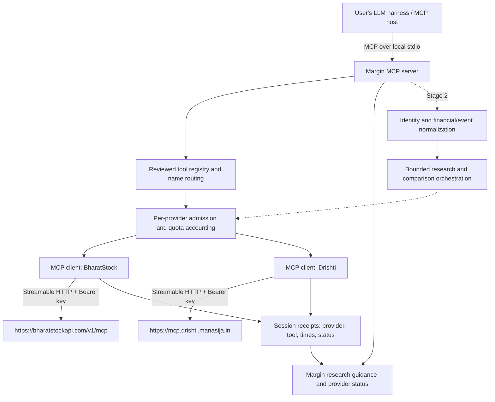

# BharatStock + Drishti aggregation plan

Proposal, researched 8 October 2026. No aggregation code is implemented. This document owns the new architecture and stage boundaries; [provider research](../research/mcp-provider-feasibility.md) owns observed endpoints, plans, source inspection and unresolved contracts. [Implementation status](../implementation.md) remains authoritative for delivered software.

## Scope and recommendation

The supplied five-page **Margin MCP** plan describes a financial intelligence interface over externally maintained Indian-market data. Its eventual normalized tools are a useful destination. The user's immediate scope is narrower: **combine BharatStock MCP and Drishti MCP into one aggregated MCP first**. The user has now explicitly allowed paid plans to be considered. No provider account, purchase or credential is assumed to exist.

Build a local Python MCP gateway that acts as a server to the user's harness and a client to the two hosted MCP servers. Start with their existing read tools, preserving their contracts. Then evaluate whether normalized company research, citations and comparisons improve the results. Do not collect or maintain a Margin financial corpus. Retrieval is on demand; the model and narrative belong to the harness.

Recommended initial subscriptions: **BharatStock Developer + Drishti Starter, published total ₹3,000/month**. Allow roughly ₹6,000 for two monthly cycles if that matches the eventual schedule; tax, top-ups, institutional/team access and billing-cycle details require checkout confirmation. Local execution requires no hosting subscription. The user's LLM costs are separate. See the research note for alternative tiers and credit arithmetic.

## Stages

| Stage | Outcome | Explicit boundary |
| --- | --- | --- |
| 0: feasibility | Authenticated inventories, actual entitlements, billing deltas, company/history coverage and schema snapshots | No promise of coverage based only on a website; start here before implementing the gateway |
| 1: aggregation | One MCP connection exposes reviewed tools from both providers, with routing, limits, receipts and independent failures | Provider-shaped results; no automatic fact normalization, price calculations or generated briefs |
| 2: financial interface | Selected semantic tools from the PDF, common financial/event records, compatible comparisons and evidence links | Build only capabilities supported by Stage 0/1 measurements |
| Later, optional | Hosted multi-user access, near-live subscriptions or more providers | Separate deployment, credential isolation and provider permission work |

The ten semantic names in the PDF are proposed Stage 2 contracts, not newly delivered tools. Existing PDF extraction and metadata utilities remain preserved on pushed `d1`. The user has now authorized clearing the legacy tracked implementation from `main`; the new branch state contains documentation and a credential template, not an aggregate server.

## Architecture



There is no financial database, web crawler, document ETL, vector index, hosted LLM or new frontend in this architecture. Providers operate their own databases. Temporary metadata about calls is operational state, not a stored market-data dataset.

The data path is an on-demand transformation: **discover capabilities → resolve the company → fetch bounded upstream results → retain provenance → return to the harness**. Stage 1 passes native results through; Stage 2 adds validation/normalization between fetch and return. The equivalent of ETL runs per request and expires with its session, without loading an owned historical repository. Do not introduce a scheduled ingestion pipeline simply to combine the connectors.

Use Python 3.12 and the official MCP Python SDK for server/client lifecycle and Streamable HTTP. The previous implementation on `d1` used that SDK; `main` has no installed-package contract yet. A low-level dynamic tool registry is a good fit for forwarding arbitrary reviewed schemas. Do not force a new protocol version: negotiate what both ends support and record the result. The current [MCP tools specification](https://modelcontextprotocol.io/specification/latest/server/tools) defines discovery/calls/results; [official SDK documentation](https://py.sdk.modelcontextprotocol.io/) is the implementation reference.

[Standalone FastMCP proxy providers](https://gofastmcp.com/servers/providers/proxy) are a credible alternative for less custom bridging code, but they are a separate package from the SDK's `FastMCP` helper. Their session and feature-forwarding defaults need explicit review. Choose that dependency only if a small compatibility exercise establishes that it preserves schemas/results and supports our admission policy better than the official SDK. Do not introduce an agent framework just to aggregate MCPs.

### Exact connections

| Connection | Address/transport | Authentication |
| --- | --- | --- |
| Harness → Margin | Local stdio; command/config to be defined at implementation | Keys supplied to Margin through the local environment, never tool arguments |
| Margin → BharatStock | `https://bharatstockapi.com/v1/mcp`, hosted Streamable HTTP | `Authorization: Bearer <BharatStock API key>`; Developer/Pro entitlement |
| Margin → Drishti | `https://mcp.drishti.manasija.in`, hosted Streamable HTTP | `Authorization: Bearer <Drishti API key>`; Drishti also offers OAuth |

Use static provider Bearer keys for the first local gateway. Its downstream stdio connection does not need an OAuth server. If Margin is later hosted, its own user authentication is a separate trust boundary: a caller's Margin token must never be forwarded as a provider key.

BharatStock's published local npm server is an alternative upstream transport if the hosted endpoint proves unreliable; it requires Node.js and remains plan-gated. Drishti's npm package is a **configuration installer**, not a second local data server. Direct REST wrappers are a separate architecture option, not a silent fallback around MCP entitlements. Stage 1 primarily sends MCP `tools/call` to the two URLs above, not a REST request to every endpoint in the research appendix.

### Registry, names and contract preservation

1. Connect and initialize each provider independently. Fetch **all pages** of `tools/list`; inspect optional prompts/resources only when advertised. Record upstream server/protocol versions, JSON Schemas and a catalog hash. Missing credentials or a failed provider must not block the other one.
2. Publish stable names such as `bharatstock__get_financials` and `drishti__get_news`, mapped back to the original names on dispatch. Never merge same-named tools merely because their descriptions look similar.
3. Review a read-tool allowlist and expose only its intersection with the live catalog. New or changed upstream tools require review; refresh metadata on reconnect/list-change notification, but do not silently publish new capabilities. Handle downstream catalog changes according to negotiated capabilities and host compatibility.
4. Preserve `inputSchema`, `outputSchema`, content blocks, `structuredContent`, annotations and `isError` where supplied. Tool descriptions can add a short provider/cost/source prefix without replacing financial semantics. Annotations are hints; the allowlist is the actual admission rule.
5. Do not wrap forwarded JSON in a new envelope while advertising the old output schema. BharatStock 0.1.2 returns **JSON text content**, not a structured financial output contract. Preserve it in Stage 1; validated parsing belongs to Stage 2.
6. Keep provenance receipts in bounded session memory and attach receipt identifiers in a namespaced result `_meta` entry where supported. Many hosts do not show `_meta` to the model, so provide a small receipt lookup tool rather than claiming metadata automatically creates visible citations.
7. Resource URIs and prompts need their own namespace and reference mapping. Initially publish Margin's own routing guidance; do not forward every upstream instruction resource or prompt automatically. If an exposed tool returns an upstream resource link, either implement its corresponding mapped read route or explicitly report that it is not resolvable through Margin. Keep original external source URLs intact.

Suggested initial research profile: ten BharatStock tools (`search_stocks`, `get_stock_quote`, `get_stock_prices`, `get_financials`, `get_stock_fundamentals`, `get_shareholding`, `get_corporate_actions`, `run_screener`, `list_indices`, `get_index_prices`) and eleven documented Drishti tools (`resolve_symbols`, `get_symbols`, `get_news`, `get_announcements`, `get_announcement_categories`, `get_events`, `list_earnings`, `get_earnings_filing`, `get_concalls`, `search_concalls`, `search_announcements`). This is **21 candidate upstream tools**, conditional on the authenticated catalog and access. The complete inspected/documented inventories are in the research note. Broader read-tool profiles can add deals, institutional flows, market discovery and mutual funds after validation.

Proposed Margin-only controls are `margin__get_provider_status`, `margin__get_research_plan` and `margin__get_call_receipts`. They report availability/estimated remaining budget, recommend a bounded route, and retrieve provider/tool/time/status receipts. They do not fetch financial content or impersonate a source verification service. Keep them in design documents until implemented.

### Sessions, failures and bounds

Maintain one upstream session per provider **per downstream credential context**, with explicit locking until safe concurrency is verified. Do not share sessions across different users or keys. Refresh expired sessions and clean up transports on shutdown. Stateless-session reuse is an optimization to validate, not an assumption about both hosted services.

Proposed initial policy, distinct from provider limits:

- At most two in-flight calls per provider. Start Drishti at 30 data calls/minute on Starter (9/minute for Sandbox), pending actual MCP throttling measurements. Start BharatStock at two data calls/second, a conservative local pacing choice, not a published provider entitlement.
- Give transport connection/initialization a 15-second deadline and ordinary calls a 45-second deadline; adjust only from measured latency, especially transcript searches. Propagate cancellation where supported, acknowledging that remote work may already have consumed quota.
- Permit one user-requested page per forwarded call; do not auto-exhaust pagination. A guidance workflow initially allows two pages per list, 30 days of events/news, 365 calendar days of prices, eight quarterly and two annual rows. Widen only explicitly. Native schemas are retained; enforce policy on validated arguments and report an error rather than secretly rewriting them.
- Start with a 2 MiB tool-result ceiling and a small request ceiling; report oversize results and request narrower filters instead of cutting off JSON or pretending a truncated result is complete. Confirm transport-level protection where the SDK allows it.
- Keep session receipts bounded (for example, 200 entries), with no raw results or secrets in logs. Start with **no data-response cache**. Cache reviewed tool metadata briefly (for example, five minutes); future data caching requires entitlement, expiry and per-key isolation review.
- No blind retry after a tool-call timeout, credit error or quota exhaustion. Retry a failed connection/catalog read at most once with backoff; call results with uncertain billing stay `unknown`. Avoid another retry layer on top of an upstream SDK that already retries.
- Distinguish unavailable provider, invalid credentials, forbidden product, quota/rate limit, insufficient credits, invalid input, upstream error and valid empty data. Preserve native tool errors; gateway-originated errors use `isError=true` with stable codes and no fake success payload.

Track native call counts separately from estimated underlying HTTP requests and observed credit deltas. The inspected BharatStock SDK can retry three times, and its HTTP wrapper performs an entitlement check: a single downstream call is **not a proven single quota unit**. Margin cannot disable the hosted service's internal retries. Its budget is advisory unless authoritative upstream counters are available. Reserve headroom and measure actual usage before claiming a hard account-wide cap. Separate local processes/other API clients can spend the same account budget.

Do not proxy upstream sampling, root access or elicitation by default. Stage 1 only needs read tools and routing guidance. Treat filings, news, tool output and upstream guidance as data, not permission to execute further actions or reveal secrets.

## Discovery and research routing

MCP discovery tells the harness which tools exist; it does not automatically discover every company/document or enforce an agent's workflow. Margin should supply a short resource/prompt and `get_research_plan` with:

1. Resolve identity; compare company name, exchange, ISIN and Drishti scrip code. Stop on ambiguous listings rather than guessing from ticker text.
2. Choose numeric tools for prices, statements and ratios; choose event tools for announcements/news/calls. State requested windows and cadence.
3. Start with list/summary tools. Search filing/transcript text only for a specific topic; request detailed data or attachments only when evidence is needed.
4. Cite original links when supplied; otherwise cite provider/tool/period and say the reference is provider-level. Return empty or partial coverage honestly.
5. Stop at the configured call/credit budget. Show what would be needed to extend coverage.

This guidance helps the host plan. The gateway enforces call-level admission and session quotas; a native MCP session alone does not reliably identify a multi-call natural-language 'research question'. Per-question budgets become enforceable in Stage 2 compound tools or when the host supplies a workflow identifier.

## Data coverage and research possibilities

The two providers own an **addressable external universe**; Margin owns neither a copy nor a guaranteed complete corpus. BharatStock advertises 5,000+ stocks and 11+ years of prices. Neither that claim nor Drishti's category list establishes complete joint coverage. Define coverage by **company × data family × time window × reporting basis × evidence depth**, and measure the intersection for combined tasks.

Here, empirical data means observed prices/volumes, disclosed financial/ownership values and dated transactions. Provider-computed ratios and classifications are derived data; event summaries, sentiment and transcript analyses are interpretations unless supported by original passages. Preserve these categories so a fluent combined answer does not give all inputs the same evidence status.

| Research task | Numeric inputs | Event/evidence inputs | Realistic first outcome |
| --- | --- | --- | --- |
| Company brief | Snapshot, quarterly/annual financials, ratios | News, announcements, recent earnings/calls | Host combines provider responses in Stage 1; normalized brief later |
| Earnings review | Revenue/profit/EPS with exact fiscal context | Earnings filing, commentary and transcript search | Explain performance and management statements; flag inconsistent basis/scale |
| Ownership/liquidity review | Shareholding, optional insider/bulk/block/MF data | Related announcements/news | Descriptive changes; transactions do not establish motives |
| Event/price timeline | Daily OHLCV and corporate actions, index series | Dated filing/news/earnings events | Observed move around an event; causal attribution is unsupported |
| Peer comparison | Compatible ratios and financial periods | Company-specific news/call themes | Stage 1 fetches inputs; Stage 2 rejects mismatched metrics/basis |
| Stock screening | BharatStock screener | Context for a bounded result shortlist | Quantitative screen followed by event enrichment, not full-universe enrichment |
| Sentiment context | Returns/volume as market-response observations | Provider news tone, management guidance and Q&A | Distinguish text tone, management outlook and price reaction; no comprehensive investor sentiment claim |

Limits to establish empirically: newer integrated filings have more balance-sheet fields; cash flow is primarily annual; SME/micro-cap financials can be empty; bank-specific fields need separate definitions; sector classifications can be absent/inferred. Historical numeric values are not necessarily historical **as-known-at-the-time** values. Latest earnings records can replace older filings; news dates and call dates are not interchangeable. Two providers may depend on the same filing, so agreement is not independent verification.

### Proposed evaluation sample, not a collection target

Begin with 12 companies: RELIANCE, TCS, INFY, HCLTECH, HDFCBANK, ICICIBANK, ITC, MARUTI, SUNPHARMA and LT, plus one verified BSE-exclusive company and one NSE SME company selected from authoritative listing metadata. Add adversarial requests for ambiguous tickers, unknown/delisted identifiers, missing periods and rate/credit failures. Confirm the actual identifiers before using them.

Request at most eight quarterly rows, two annual rows, one year of daily prices and 30 days of news/events per company, with up to two recent call records where available. The corresponding requested slots are 96 quarterly rows, 24 annual rows and roughly 3,000 stock trading-day observations across 12 firms; these are estimates/targets, **not observed data**. Calls and events have irregular density: do not invent a record count or claim absence of events from an empty response.

Inspect two financial metrics per company against an original filing where obtainable (24 independently reviewed cells), and event timestamps/URLs for two returned records per company where present. Include bank and SME negative cases. Keep permitted snapshots private and temporary; commit synthetic/minimized fixtures plus aggregate evaluation results, hashes and method. Do not create a market dataset to meet the evaluation target.

For event analysis later, align announcement publication time to the Indian trading calendar; after-close, weekends and holidays require explicit rules. Use split/bonus-adjusted close consistently with corporate actions; it is not dividend-reinvested total return. Compare a short window such as five trading days before/after with a matching market benchmark. Simple return `P_t/P_(t-1)-1` and stock-minus-benchmark return are descriptive; a formal event study also needs an estimation window, event selection, confounder controls, point-in-time data and uncertainty reporting. These providers have not yet been shown sufficient for causal research or backtesting.

## Stage 2 normalization and semantic tools

Normalize after native payloads have been measured, not from example numbers. Shared records should preserve:

- Security identity: issuer/name, exchange, ISIN, ticker, scrip code, listing state and match confidence. ISIN identifies a security, not necessarily an entire corporate group.
- Financial fact: original field/value, currency, scale, canonical metric only when mapped, period end/duration/fiscal label, standalone/consolidated basis, audit/revision state, provider and filing/source locator if available. Unknown is explicit; missing is never zero.
- Price: exchange, trading date, OHLCV, raw/adjusted close and adjustment method, data as-of time. 'Latest' must mean latest available observation, not live tick.
- Event: native ID, company/security links, type, publication time, effective/event date, provider retrieval time, headline/summary, original source URL, provider analysis label and deduplication/conflict status.
- Evidence: provider/native-record/tool identity, retrieval time, original URL and document/page/span only when actually available. A presigned link is an expiring locator, not a permanent citation.

Proposed semantic mapping: `search_stocks` → identity tools; `get_stock_snapshot` → quote/ratios; `get_financial_history` → financials; `get_shareholding` and `get_corporate_actions` → corresponding native tools; `get_recent_events` → events/announcements/earnings; `get_company_news` → news; `screen_stocks` → screener; `compare_companies` → independently fetched compatible inputs; `research_company` → a bounded selection across both. BharatStock `compare_sector_peers` is sector-scoped, not a general arbitrary-company comparator. Keep native tools available for debugging/advanced research instead of silently changing their behavior.

Citation creation and verification remain distinct. First report which provider/tool produced a value. Then link an actual document or article when supplied. Claim page-level support only after resolving the document/page and checking the stated claim. Drishti's public REST schema includes earnings/concall citation routes, but exposure through MCP and link behavior must be tested; those routes do not justify promising automatic verification in Stage 1.

## Implementation sequence and team ownership

The following is the proposed build sequence. The current user has authorized branch cleanup/push and endpoint testing; no gateway implementation has been started:

| Step | Deliverable | Exit gate |
| --- | --- | --- |
| Access exercise, 1–2 working days | Accounts/keys supplied securely; catalog/schema snapshots; per-tool billing and 12-company coverage table | Both MCPs authenticated; selected native tools callable; quotas and unknowns recorded |
| Minimal bridge, 2–3 days | Provider-only startup, two MCP clients, reviewed registry, namespaced dispatch, shutdown | One stdio client lists/calls both sources; no SQLite/import prerequisite |
| Reliability, 2–3 days | Admission limits, provider isolation, receipts, size/time bounds, explicit errors | Quota/credit/timeout/schema-drift tests; repeated calls do not duplicate secretly |
| Host evaluation, 2–3 days | Routing guidance, install instructions, paired direct-versus-aggregated tasks | One real model host completes numeric + event tasks; differences/costs measured |
| Later semantic work | A few normalized tools selected from evidence | Financial contexts/source support checked independently; no automatic expansion to all ten tools |

For four people: A owns upstream access/catalog contracts; B owns MCP dispatch/lifecycle; C owns identity, provenance and budget policy; D owns independent evaluation and docs/host demonstration. Work against the same schema snapshot and small task set. No subagents were used for this research.

Proposed package boundaries, subject to a later repository transition:

```text
src/margin_mcp/
  server.py              downstream MCP surface and lifecycle
  upstream/              configurations, sessions, registry and dispatch
  policy/                admission, budgets, timeouts and result bounds
  provenance/            bounded call receipts
  guidance/              research routing resource/prompt
  normalization/         Stage 2 only
  research/              Stage 2 compound services only
tests/                   synthetic upstreams, transport tests, opt-in live checks
docs/                    status, contracts, usage, design and dated research
```

Accept Stage 1 when: one connection exposes tools from both providers; schemas and representative content blocks survive forwarding; provider failure is independent; credential contexts are isolated; no source data/key leaks to logs; restart requires no corpus; budgets/cancellation/errors are tested; a real host completes at least six paired tasks with recorded calls/credits, evidence quality and limitations. Software transport success is separate from financial accuracy.

Compare **directly attached two MCPs vs Margin's aggregate** with the same host/model/windows and credentials. Stage 1 primarily improves configuration, policy and observability; do not assume an accuracy gain. Stage 2 can compare normalized orchestration against this baseline. Include ambiguity, unavailable history and unsupported claims in the evaluation, not just happy-path summaries.

## Repository transition and product boundary

`d1` preserves the prior committed implementation at `c77963d` and has now been pushed to GitHub. The user subsequently authorized clearing `main`: aggregation planning was committed first (`be04aba`), then legacy tracked runtime/tests/examples/CI/manifests and superseded docs were removed through a normal reviewable transition. Current architecture/research remain on `main`; historical citation and corpus designs are available on [`d1`](https://github.com/rishitttt/margin-mcp/tree/d1/docs). No reset, force-push or gateway implementation is involved. Ignored local documents/databases/environments remain private.

Plan 1 is a private/local connector using an entitled user's own credentials. Paying for API access does **not** automatically authorize a public MCP that republishes raw results. BharatStock's published terms materially restrict re-serving data, competing data products, key sharing and retained data after a subscription ends. A BYOK gateway is the proposed development model, not a determination that every distributed/hosted use is permitted. Obtain provider clarification for the intended product and team access before public operation. Drishti's public technical docs do not settle redistribution rights either. No outreach or purchase has occurred.

Open evidence gates: authenticated Drishti schemas and complete catalog; both hosted transport versions; exact MCP rate-limit enforcement and billing of empty/error/detailed/search calls; underlying BharatStock request counting; units/basis accuracy; event history depth and original links; citation routes through MCP; team/product permissions. These require accounts or provider answers. None requires building a Margin-owned corpus.
